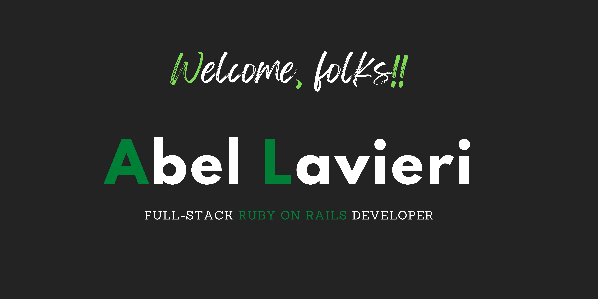

 

# Hello there! A little about me 👇

```
alvp01 = {
  "code" => ["Javascript", "Typescript", "Ruby", "C++", "Java"],
  "tools" => ["Ruby on rails", "React", "Redux", "Jest", "Rspec"],
  "architecture" => ["Progressive web app", "Single page app"],
  "data_base" => ["MariaDB", "PostgreSQL", "MySQL", "SQLite"],
  "devops" => ["AWS", "Netlify", "Heroku"],
  "about_me" => {
    current_focus: "Looking for a job as a RoR developer. 
      Wanting to build a strong online presence and make connections."
  }
}
```

# Profile Stats 📈

[](https://github.com/anuraghazra/github-readme-stats)
